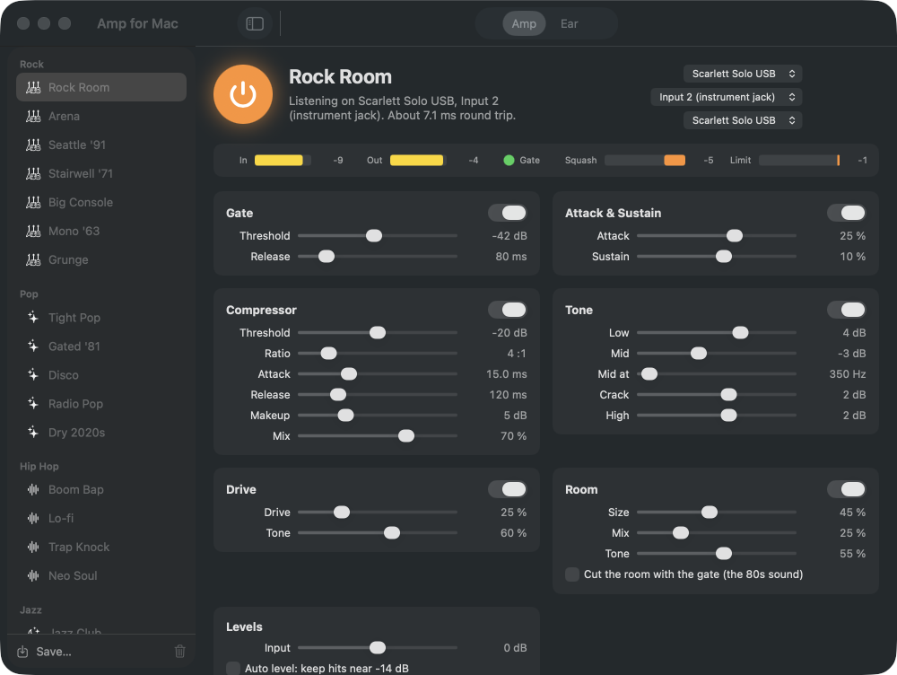
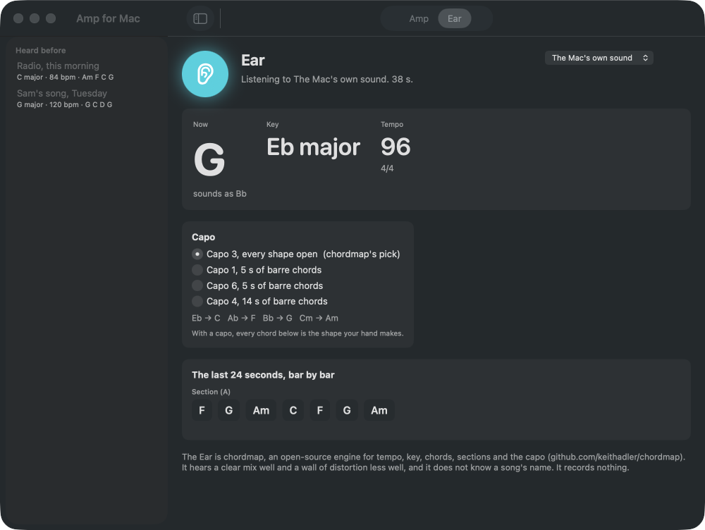

# Amp for Mac

A guitar amp and a drum amp for the input of your audio interface, and an Ear, powered by [chordmap](https://github.com/keithadler/chordmap), that tells you the key, the tempo, the chords bar by bar and where the capo goes. It listens to one input and plays to one output. Nothing is recorded, nothing leaves the Mac.

## Download

**[Download Amp-for-Mac-1.2.0.dmg](https://github.com/keithadler/ampmac/releases/latest/download/Amp-for-Mac-1.2.0.dmg)** (macOS 14 or later, Apple Silicon)

Open the DMG, drag the app to Applications, open it. The first time, macOS says the app is from an unidentified developer: right-click the app, choose Open, then Open again. That is once.

Two permissions, each asked for once, each explained in the dialog: **Microphone**, because macOS treats an interface input as a microphone and the amp cannot hear the drums without it; and **System Audio Recording**, only if you use the Ear on the Mac's own sound. The app records nothing with either.



## The guitar amp

Switch the window to Guitar and it is an amp: gain, bass, middle, treble, presence, master, sag, a
noise gate, a room, and a speaker to play it through. Twenty-four presets in seven kinds — Clean,
Crunch, Lead, Metal, Blues, Country and Indie — named for the room, the town and the year.

The speaker is the part that matters. A distorted guitar with no cabinet is a wasp in a tin: it is
all the energy above five kilohertz that a twelve-inch driver cannot make. Five cabinets are offered
(4×12, 2×12, 1×12, 1×8, and none at all), each a low cut, a resonance, the cone dip that gives a
speaker its voice, a presence peak and the fall a driver has above about five kilohertz. Nothing here
is a recording of a cabinet; it is filters shaped like one, so the app still ships with no assets in
it. The clipping runs at twice the sample rate, so the harmonics distortion makes above half the
sample rate do not fold back down as tones nobody played.

### An acoustic, played as an electric

Plug an acoustic in and the app can tell. A magnetic pickup is a coil, and a coil cannot make much
above five kilohertz; a piezo under the saddle has real energy at eight and twelve. That is a
difference of more than thirty times in how much of the signal lives up there, so which guitar is
plugged in is decided by listening, only while you are playing, and slowly enough that it never
changes its mind mid-bar. Set it by hand instead if you would rather.

When it hears an acoustic, it makes it look like a magnetic pickup before the amp sees it: the body
boom under a hundred hertz comes off, the hard quack around three and a half kilohertz that turns to
broken glass the moment you distort it is taken out, the air above five kilohertz goes, a coil's own
resonance goes on in their place, and the spike of the pick is rounded into a swell. One knob moves
that resonance from a neck pickup to a bridge. Everything after it is the ordinary amp, so every
preset and every speaker behaves exactly as it does for an electric.

## The drum amp

Plug a mic or a trigger into the interface, press the power button, play. The chain is what a drum channel on a desk does, in order: a gate with hold, an attack and sustain shaper, a compressor with a mix knob for parallel squash, four-band tone (low, a mid you place, the crack at 3.5 kHz, high) with a rumble filter, drive, a stereo room with its own tone that can cut with the gate, and a limiter half a dB under full. Every knob glides, so presets switch while you play.

Thirty-nine presets in twelve genres, named for the room, the town and the year rather than anyone's trademark: Rock (Rock Room, Arena, Seattle '91, Stairwell '71, Big Console, Mono '63, Grunge), Pop (Tight Pop, Gated '81, Disco, Radio Pop, Dry 2020s), Hip Hop (Boom Bap, Lo-fi, Trap Knock, Neo Soul), Jazz (Jazz Club, Brushes, Big Band), Metal (Tight Metal, Thrash, Doom), Soul & Funk (Detroit '65, Funk Dry, Memphis Soul), Country & Folk (Nashville, Americana), Punk & Garage (Garage, Bowery '76), Blues (Juke Joint, Chicago), Reggae (One Drop, Dub), Electronic (Dance, Industrial) and Studio (Clean Kit, Dry Punch, London '69, Dead 70s). Save your own beside them; ⌘1 to ⌘9 jump between the first nine.

A level guide reads the raw input and says which way to turn the gain knob on the interface. Auto level, off unless you switch it on, then trims the amp's own input gain by up to 12 dB so hits land near -14 dB. Clipping at the interface is the knob's job, and the guide says so. Every preset is trimmed to land at the same loudness as what went in, so switching presets never jumps the volume.

Round trip on a Scarlett Solo is a few milliseconds: two buffers plus what the interface reports. 128 frames is the default; 64 is fine on Apple Silicon. The number is in the status line.

## The Ear



Switch to Ear, press the ear, play a song on the Mac. Every two seconds chordmap re-hears the last 24 seconds: the chord now, the key with its runner-up, the tempo and meter, the bars of the stretch grouped by section, and its capo pick with the shapes (Eb: capo 3, Eb → C, Ab → F, Bb → G). Choose another capo and every chord shown becomes the shape your hand makes. When you stop, the whole listen is charted, with chordmap's chord sheet to copy. It can also listen to an input, so a guitar into the interface works too.

Every listen is kept, with the whole chart, in the sidebar. Retitle it, reopen it, delete it. The list lives in `~/Library/Application Support/Amp for Mac/listens.json` and nowhere else.

chordmap hears a clear mix well and a wall of distortion less well, flags sparse harmony instead of inventing chords, and does not know a song's name. Hearing the Mac's own sound needs macOS 14.2 or later.

## Pedals

Two stomp boxes under the amp: pedal 1 in front of it, pedal 2 after it. Screamer, Fuzz, Squeeze, Chorus, Echo and Tremolo, three knobs each. Every preset ships with the two a player of that sound would most likely have on the floor, switched the way they would leave them; a lead sound has its boost and echo on, a clean sound the compressor on and a chorus ready, a hip hop kit a crush. ⌘⌥1 and ⌘⌥2 stomp them without looking. Pedals are saved with a preset; the guitar you plugged in and its pickup position are yours and survive preset changes and relaunches.

## Latency, and playing into Suno

The Latency menu under the devices runs from Fastest (32 frames) to Safe (256), with the measured round trip beside it. To play into Suno or record in another app, set Amp's output to a virtual device such as BlackHole, pick that as the microphone in the other app, and choose Fast. Amp still records nothing.

## Honest limits

- It is a standalone amp, not a plugin. It will not load in Logic or Live.
- Turn the interface's direct-monitor knob or switch off, or you hear the dry kit and the amp together.
- Latency is the interface's. A USB interface at 128 frames is about 5 to 8 ms round trip; the Mac's built-in input and speakers are slower and feed back.
- The limiter keeps the output under full scale; it cannot un-clip an input that arrived clipped.
- A microphone in the same room as the monitors will feed back through any amp with gain in it. Headphones, or monitors kept low and away from the kit, are the fix; the app keeps its presets at unity to help.
- The Ear has no idea what song is playing, only what key and chords it hears.
- Apple Silicon only for now. The Intel build needs the Rust toolchain's Intel target on the build machine; it follows.

## Command line

`ampmac` is linked into your PATH by the installer, or call `/Applications/Amp\ for\ Mac.app/Contents/MacOS/AmpMac`.

```
ampmac status                          devices chosen, latency, permissions
ampmac devices                         every audio device
ampmac presets [<name>]                the presets, or one preset's knobs as JSON
ampmac run --preset "Rock Room"        the amp from the terminal, meters and level advice once a second
ampmac render kit.wav out.wav --preset Garage
ampmac tone kit.wav                    a synthesised kit to try the amp with
ampmac tone song.wav --chords "C G Am F" --bpm 100   a strummed progression from chordmap's synth
ampmac chords song.wav [--capo 3]      the Ear on a recording: key, tempo, capo, the chord sheet
ampmac ear [--source mac|Scarlett]     the Ear live
ampmac selftest                        the built-in tests
```

`--json` everywhere. Exit codes: 0 fine, 1 something to look at, 2 problem, 64 usage.

## Building

Swift Package, macOS 14 or later, the Command Line Tools plus Rust (rustup) for the chordmap bridge in `ffi/`.

```
./build-app.sh --install
```

`ffi/build.sh` builds chordmap as a static library for every Apple target the Rust toolchain has; add `x86_64-apple-darwin` with rustup for a universal build.

`./make-local-identity.sh` once makes a local signing certificate so permissions survive rebuilds. `ampmac selftest` and `tests/integration.sh` run the tests; the tests feed the chain synthesised hits and chords and never open a device.

## Privacy

See [PRIVACY.md](PRIVACY.md). The short version: the microphone permission is for hearing the interface, the system-audio permission is for the Ear, and neither records anything. The only connection the app ever makes is the optional daily check of the GitHub releases page for a new version.

## License

MIT. Made by Keith Adler. More from the same maker at [keithadler.github.io](https://keithadler.github.io).
